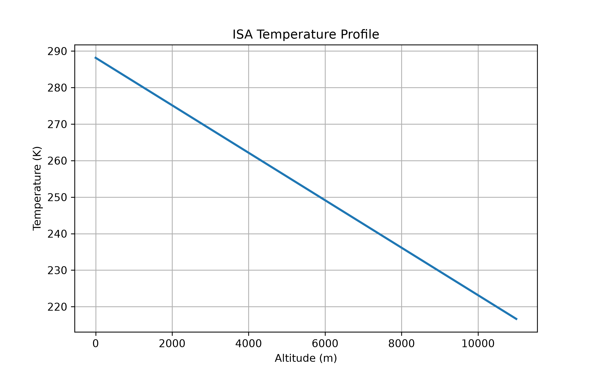
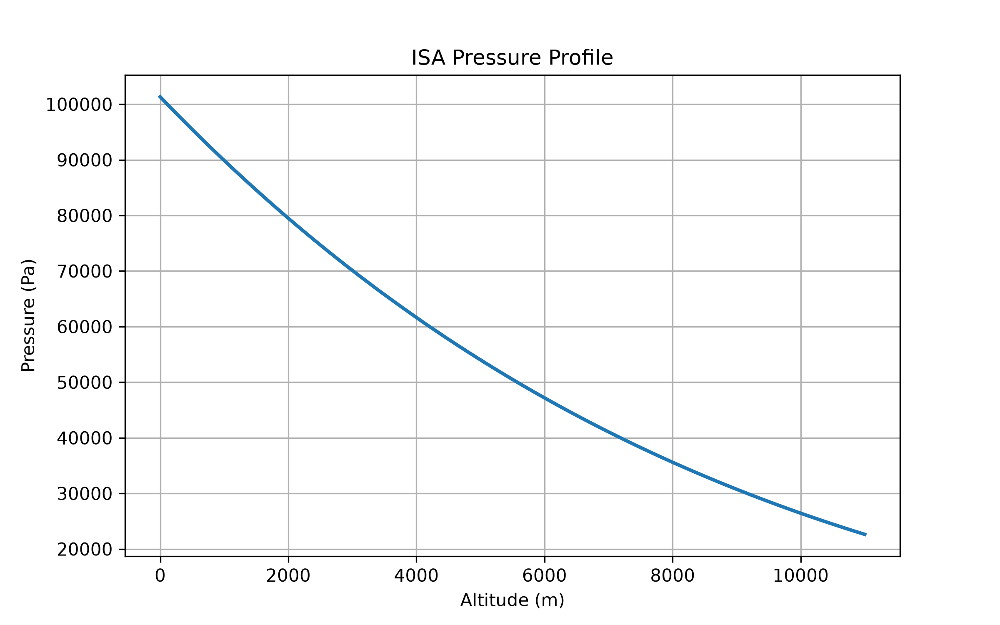
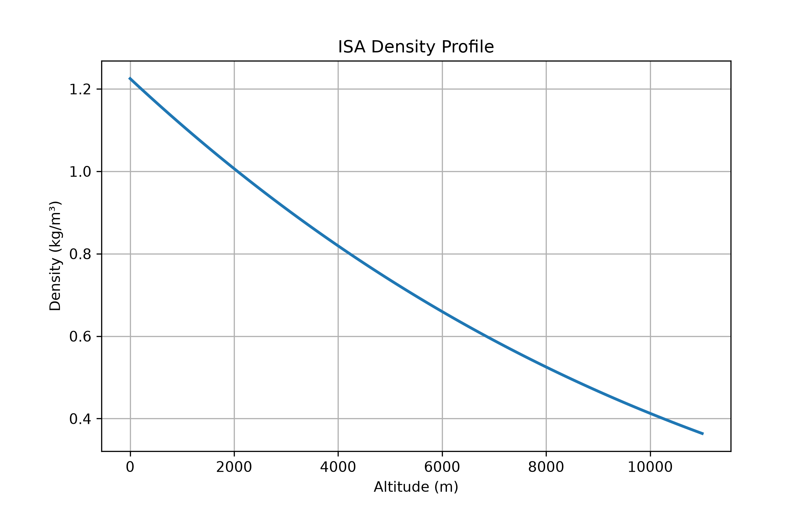
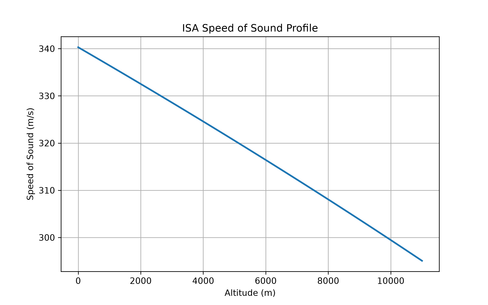

<p align="center">
  
</p>

<p align="center">


</p>

# 🌍 Atmospheric Model

> A Python implementation of the International Standard Atmosphere (ISA) for aerospace engineering applications.

Part of the **AeroPortfolio**, a collection of aerospace engineering software projects developed to learn, simulate and analyze real aerospace systems.

---

## Contents

- [Features](#-features)
- [Project Structure](#-project-structure)
- [Markdown](#️-markdown)
- [Installation](#️-installation)
- [Quick Start](#-quick-start)
- [Generated Results](#-generated-results)
- [Scientific Background](#-scientific-background)
- [Testing](#-testing)
- [Roadmap](#-roadmap)
- [AeroPortfolio](#-aeroportfolio)
- [License](#-license)

## ✨ Features

- 🌡️ Temperature calculation
- 🌬️ Pressure calculation
- ☁️ Air density calculation
- 🔊 Speed of sound calculation
- 📈 Scientific plots
- 🧪 Automated tests with pytest
- 🧩 Modular architecture
- 🚀 Designed for future aerospace simulators

---

## 📁 Project Structure

```text
atmospheric-model/

├── docs/
├── examples/
├── images/
├── src/
│   └── atmospheric_model/
├── tests/
├── README.md
├── requirements.txt
└── pyproject.toml
```

---

## 🎯 Project Goals

This project aims to provide a clean, modular and reusable implementation of the International Standard Atmosphere (ISA) that can serve as the foundation for future aerospace simulation projects within the AeroPortfolio ecosystem.

## ⚙️ Installation

```bash
git clone https://github.com/YOUR_USERNAME/atmospheric-model.git

cd atmospheric-model

pip install -r requirements.txt
```

---

## 🚀 Quick Start

```python
from atmospheric_model import Atmosphere

atm = Atmosphere(5000)

atm.summary()
```

Example output:

```text
Altitude: 5000.0 m
Layer: Troposphere
Temperature: 255.65 K
Pressure: 54019.91 Pa
Density: 0.7361 kg/m³
Speed of sound: 320.53 m/s
```

---

## 📊 Generated Results

The library can automatically generate atmospheric profiles.

### 🌡️ Temperature Profile

<p align="center">
  
</p>

---

### 🌬️ Pressure Profile

<p align="center">
  
</p>

---

### ☁️ Density Profile

<p align="center">
  
</p>

---

### 🔊 Speed of Sound Profile

<p align="center">
  
</p>

## 📚 Scientific Background

The project implements the International Standard Atmosphere (ISA) within the troposphere.

Currently implemented:

- Temperature
- Pressure
- Density
- Speed of sound

Future versions will include additional atmospheric layers and more advanced atmospheric models.

---

## 🧪 Testing

Run all automated tests:

```bash
pytest
```

---

## 🗺️ Roadmap

- [x] ISA Troposphere
- [x] Temperature
- [x] Pressure
- [x] Density
- [x] Speed of sound
- [x] Scientific plots
- [x] Automated tests
- [ ] Complete ISA atmosphere
- [ ] CSV export
- [ ] JSON export
- [ ] NumPy support

---

## 🌍 AeroPortfolio

This project is part of **AeroPortfolio**, a collection of aerospace engineering projects documenting my learning journey throughout my Aerospace Engineering degree.

| Project | Description |
|---------|-------------|
| 🌍 [Atmospheric Model](https://github.com/Lu-rde/atmospheric-model) | International Standard Atmosphere implemented in Python |
| 🚀 [Rocket Flight Simulator](https://github.com/Lu-rde/rocket-flight-simulator) | Numerical simulation of vertical rocket flight |
| 🛰️ Orbital Mechanics | *Coming Soon* |
| 📡 CubeSat Mission Analysis | *Coming Soon* |

The goal of AeroPortfolio is to progressively develop a collection of open-source aerospace engineering tools covering atmospheric modelling, flight dynamics, orbital mechanics and space systems.

Explore the complete portfolio here:

➡️ **https://github.com/Lu-rde/AeroPortfolio**

---

## 📄 License

This project is released under the MIT License.